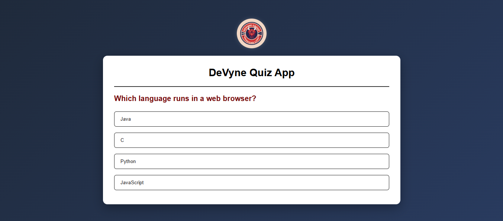

# 🧠 DeVyne Quiz App

## 📸 App Preview

Here’s how your quiz looks in action:

> 

---

## 🎥 Demo Video

▶️ [Watch the Demo](https://siddhantshukla108.github.io/DeVyne-Quiz-App/)

---

## 🚀 Features

- ✅ Interactive multiple-choice questions  
- ✅ Instant correct/incorrect feedback  
- ✅ Score tracking  
- ✅ Play Again option  
- ✅ Responsive and minimal UI  
- ✅ Smooth UX with button disabling and state reset  
- ✅ Easy-to-add new questions  
- ✅ Clean and modern design with custom styling  

---

## 🛠️ Tech Stack

- **HTML5**
- **CSS3** (Flexbox layout, transitions, custom styles)
- **JavaScript** (DOM manipulation, logic flow)

---

## 📁 Folder Structure

/project-root <br/>
│ <br/>
├── index.html # Main HTML file <br/>
├── style.css # Styling for layout and UI <br/>
├── script.js # JS logic for quiz functionality <br/>
└── /images <br/>
└── Logo.jpg # Logo used in the app <br/>


## 📦 How to Run Locally

1. Clone this repo or download the ZIP  
2. Make sure all files are in the same directory  
3. Double-click `index.html` to open in your browser  
4. Start answering and test your score!

```bash
https://github.com/siddhantshukla108/DeVyne-Quiz-App.git
cd devyne-quiz-app
start index.html

```


## 📞 Contact Me

📧 **Email:** shuklasiddhant365@gmail.com  
💼 **LinkedIn:** [siddhant-shukla108](https://www.linkedin.com/in/siddhant-shukla108/) <br/>
🐦 **Twitter:** [siddhant_shuk1a](https://x.com/siddhant_shuk1a)  
🌍 **Portfolio:** [siddhantshukla-portfolio](https://siddhantshukla-portfolio.netlify.app/)

---

> ⭐ Don’t forget to star the repo if you like it!  
> 🤝 Contributions, issues, and suggestions are welcome!
